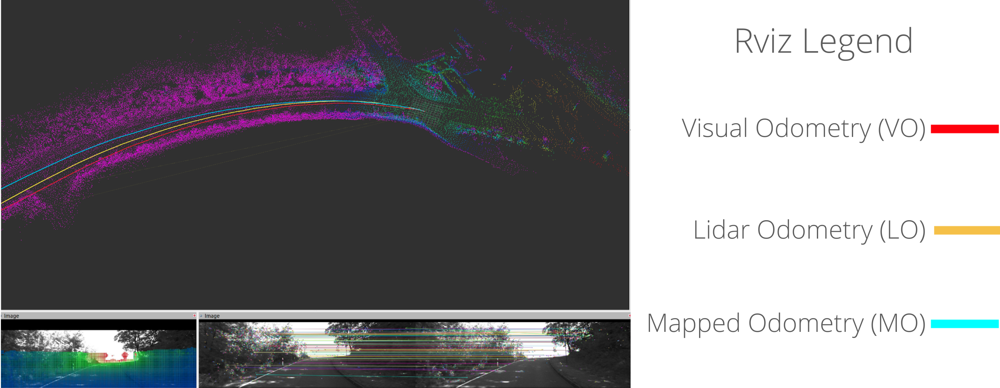
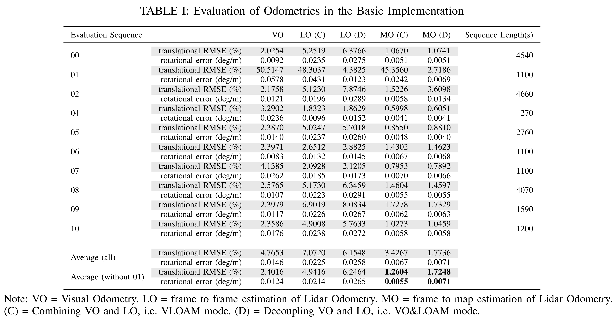
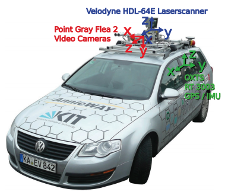

# Introduction

This repository is a reimplementation of the VLOAM algorithm [1]. The LOAM/Lidar Odometry part is adapted and refactored from ALOAM [2], and the Visual Odometry part is written according to the DEMO paper [3].

The following figure [1] illustrates the pipeline of the VLOAM algorithm. 

# Results

Video: https://youtu.be/NnoxB3r_cDM

# Detailed Usage

Check README.md under `src/vloam_main`
## Prerequisites

OpenCV 4.5.1
Eigen3 3.3
Ceres 2.0
PCL 1.2

## Evaluation tool

https://github.com/LeoQLi/KITTI_odometry_evaluation_tool

## Data format

Place bag files under "src/vloam_main/bags/"

Note: current dataloader only support "synced" type dataset. 

# Reference:

[1] J. Zhang and S. Singh. Laser-visual-inertial Odometry and
Mapping with High Robustness and Low Drift. Journal of
Field Robotics. vol. 35, no. 8, pp. 1242–1264, 2018.

[2] T. Qin and S. Cao. A-LOAM. https://github.com/HKUST-Aerial-Robotics/A-LOAM

[3] Zhang, Ji, Michael Kaess, and Sanjiv Singh. "Real-time depth enhanced monocular odometry." 2014 IEEE/RSJ International Conference on Intelligent Robots and Systems. IEEE, 2014.