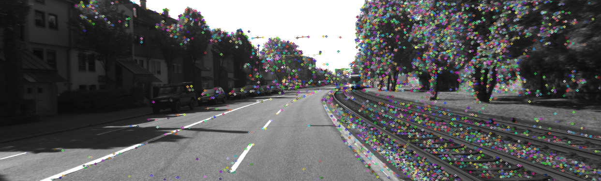
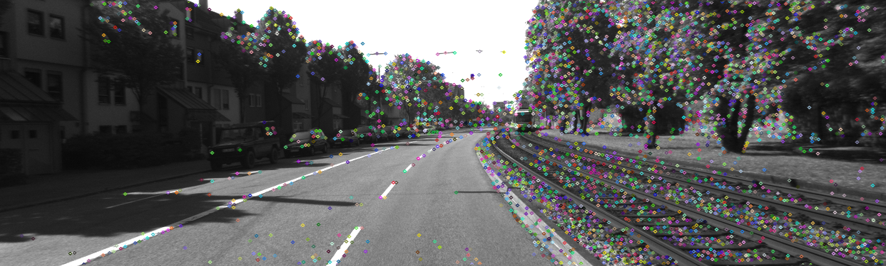
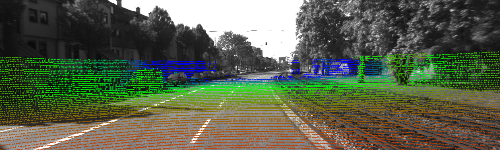
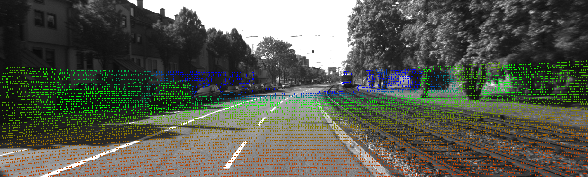
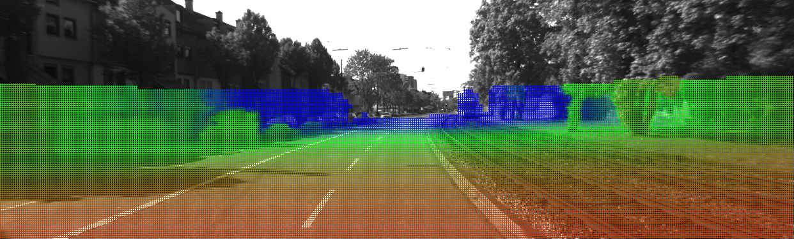
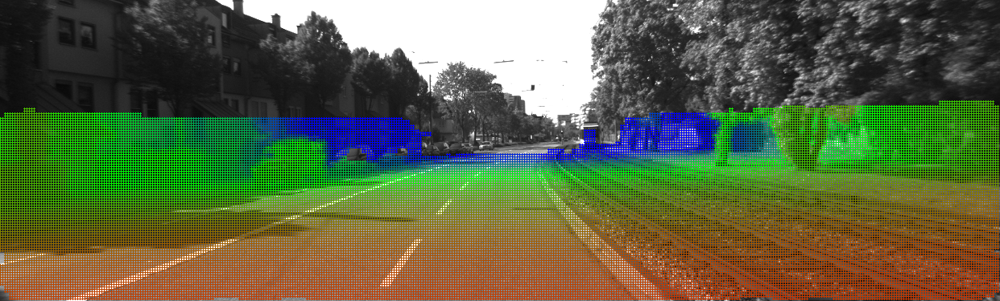

# Prerequisites

OpenCV 4.5.1
Eigen3 3.3
Ceres 2.0

# Troubleshooting

## 1. Catkin_Make fail with cv_bridge not found 

Solution: Modify `_include_dirs` in cv_bridgeConfig.cmake (at line 96)

The default `_include_dirs` is set by `set(_include_dirs "include;/usr/include/opencv4")`, while my opencv is installed under `/usr/local/include/opencv4`.

Reference: https://github.com/cipherdev/src/issues/13

## 2. Installing Ceres

I installed the [latest stable release](http://ceres-solver.org/ceres-solver-2.0.0.tar.gz) as mentioned in http://ceres-solver.org/installation.html. At step "make test", my computer got stuck at step 31 "dynamic_sparsity_test". This happened to both latest stable release and latest github repository. This bug was ignored, and I went to the next command "make install".

## 3. Using catkin_make with Ceres

- Bug 0: Cmake error, `Could not find a package configuration file provided by "Ceres" with any of the following names: CeresConfig.cmake ceres-config.cmake`
    - Reason: Ceres path is not recognized by Cmake
    - Fix: Add `set(Ceres_DIR "/usr/local/lib/cmake/Ceres/")` to CMakeLists.txt
- Bug 1: fatal error: Eigen/Core: No such file or directory
    - Reason: the installation folder of Eigen is under .../eigen3/Eigen/...
    - Fix: `sudo ln -s /usr/local/include/eigen3/Eigen /usr/include/Eigen`
    - Reference: https://github.com/opencv/opencv/issues/14868
- Bug 2: integer_sequence’ is not a member of ‘std’
    - Reason: Ceres 2.0 relies on c++ 14
    - Fix: change `add_compile_options(-std=c++11)` to `add_compile_options(-std=c++14)`
- Bug 3: test_ceres.cpp:(.text+0xe4): undefined reference to `ceres::Problem::Problem()'
    - Reason: Ceres library was not linked
    - Fix: Add `${CERES_LIBRARIES}` to target_link_libraries. Eg. `target_link_libraries(YOUR_TARGET_EXEC ${catkin_LIBRARIES} ${CERES_LIBRARIES})`

Hello world file then returns me the following results
>rosrun visual_odometry test_ceres   
>
>iter      cost      cost_change  |gradient|   |step|    tr_ratio  tr_radius  ls_iter  iter_time  total_time
>
>   0  4.512500e+01    0.00e+00    9.50e+00   0.00e+00   0.00e+00  1.00e+04        0    1.72e-05    1.09e-04
>
>   1  4.511598e-07    4.51e+01    9.50e-04   9.50e+00   1.00e+00  3.00e+04        1    4.20e-05    1.95e-04
>
>   2  5.012552e-16    4.51e-07    3.17e-08   9.50e-04   1.00e+00  9.00e+04        1    7.87e-06    2.11e-04
>
>Ceres Solver Report: Iterations: 3, Initial cost: 4.512500e+01, Final cost: 5.012552e-16, Termination: CONVERGENCE
>
>x : 0.5 -> 10

# Kitti

## Data in ROS BAG version

Data converted to ROS BAG can be downloaded from [google drive](https://drive.google.com/drive/folders/1Za3Csvq2ljI_88RoNnltZ1Dx4OWRlb8j?usp=sharing)

Right now it contains `2011_09_26_drive_{0001, 0002, 0005}`. 

## raw data usage

Reference: http://www.cvlibs.net/datasets/kitti/raw_data.php

There're 4 image folders under each timestamp dataset: "image_00", "image_01", "image_02", "image_03". They correspond to grey left camera, grey right camera, RGB left camera, RGB right camera.

NOTE: Currently, the running of the test code relies on that catkin_ws follows the following tree structure. And please run code at the root of catkin_ws.

- catkin_ws
    - build
    - data
        - 2011_09_26
            - 2011_09_26_drive_0001_sync
            - calib_cam_to_cam.txt
            - calib_velo_to_cam.txt
    - devel
    - src

## calibration file

Reference: https://github.com/yanii/kitti-pcl/blob/master/KITTI_README.TXT

>calib_cam_to_cam.txt: Camera-to-camera calibration
>--------------------------------------------------
>
>  - S_xx: 1x2 size of image xx before rectification
>  - K_xx: 3x3 calibration matrix of camera xx before rectification
>  - D_xx: 1x5 distortion vector of camera xx before rectification
>  - R_xx: 3x3 rotation matrix of camera xx (extrinsic)
>  - T_xx: 3x1 translation vector of camera xx (extrinsic)
>  - S_rect_xx: 1x2 size of image xx after rectification
>  - R_rect_xx: 3x3 rectifying rotation to make image planes co-planar
>  - P_rect_xx: 3x4 projection matrix after rectification
>
>Note: When using this dataset you will most likely need to access only
>P_rect_xx, as this matrix is valid for the rectified image sequences.
>
>calib_velo_to_cam.txt: Velodyne-to-camera registration
>------------------------------------------------------
>
>  - R: 3x3 rotation matrix
>  - T: 3x1 translation vector
>  - delta_f: deprecated
>  - delta_c: deprecated
>
>R|T takes a point in Velodyne coordinates and transforms it into the
>coordinate system of the left video camera. Likewise it serves as a
>representation of the Velodyne coordinate frame in camera coordinates.
>
>calib_imu_to_velo.txt: GPS/IMU-to-Velodyne registration
>-------------------------------------------------------
>
>  - R: 3x3 rotation matrix
>  - T: 3x1 translation vector
>
>R|T takes a point in GPS/IMU coordinates and transforms it into the
>coordinate system of the Velodyne scanner. Likewise it serves as a
>representation of the GPS/IMU coordinate frame in Velodyne coordinates.

From the paper "Vision meets robotics: The KITTI dataset", the `P_rect` is defined with element(1,3) and element(2,3) to be 0, but in real calibration file, these two entries are not necessarily exactly zero, especailly element(1,3). Anyway, the value would be 2 orders smaller than element(0,3).

Eq.7 in the origin paper: 

$$y = P_{rect}^{(i)} R_{rect}^{(0)} T_{velo}^{cam} x$$

$P_{rect}^{(i)}$ is 3x4, named as project, but is actually the intrinsics K.

$R_{rect}^{(0)}$ is 4x4, named as rotation, but is actually appended with an unit diagonal element. This transforms from unrectified camera i to rectified camera i.

<!-- Left to $T_{velo}^{cam}$, there should be one more transformation if $i \ne 0$, $\begin{bmatrix} R_{0i} & T_{0i} \\ 0 & 1 \end{bmatrix}$, transforming points from camera 0 to camera i. (Or in the inverse direction? This should be further examined.) -->
<!-- use R_rect_00 everywhere, reference https://github.com/utiasSTARS/pykitti/issues/34 -->

$T_{velo}^{cam}$ is 4x4, consistent with the name. It transforms points from velodyne coordinate to (unrectified) camera 0 coordinate.

## odometry data

From http://www.cvlibs.net/datasets/kitti/eval_odometry.php: 
- Download odometry data set (grayscale, 22 GB)
- Download odometry data set (color, 65 GB)
- Download odometry data set (velodyne laser data, 80 GB)
- Download odometry data set (calibration files, 1 MB)
- Download odometry ground truth poses (4 MB)
- Download odometry development kit (1 MB)

OpenCV load dataset: https://docs.opencv.org/3.4/dc/dfb/group__datasets__slam.html

## Processing KITTI data

### Image with Keypoints

Performance:

- Image0: Shi-Tomasi detection with n=2767 keypoints in 15.5039 ms
- Image1: Shi-Tomasi detection with n=3062 keypoints in 12.8016 ms
- Image0: ORB descriptor extraction in 6.35671 ms
- Image1: ORB descriptor extraction in 5.10074 ms

### Image with Point Cloud

### Image with Downsampled Point Cloud (grid size = 5)

### Depth Image Estimated by averaging the 3 Nearest Neighbors' Depth in the Downsampled Point Cloud

### Depth Image Estimated by Fitting a Plane from the 3 Nearest Neighbors in the Downsampled Point Cloud

This method is recommended in the original DEMO paper, but in the current downsampling method and hyperparameter setting, it's estimation quality is visually lower than naive averaing estimation.
