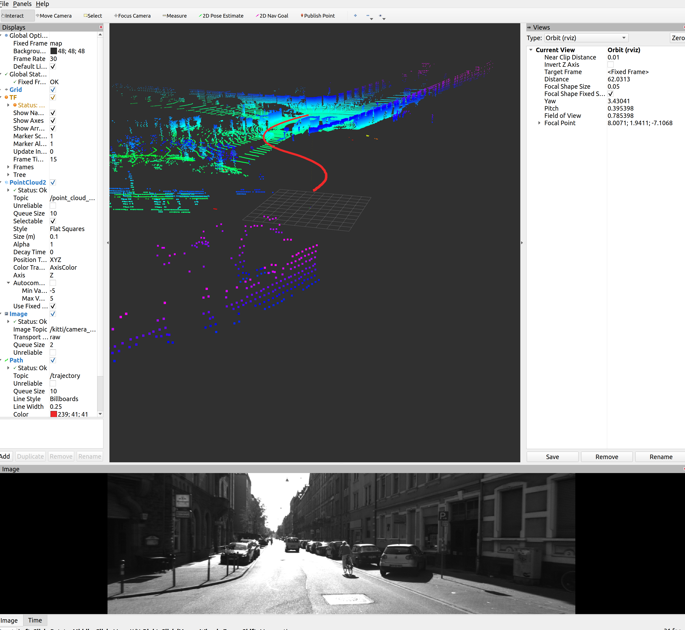

# Prerequisites

OpenCV 4.5.1
PCL 1.2

# Usage 1

- Step 1, download bag files under "/bags"

- Step 2, `catkin_make`, and then `roslaunch vloam_main vloam_main.launch`

- Step 3, check the sequence number and date for the bag file, and in another terminal, run
```
rostopic pub /load_small_dataset_action_server/goal vloam_main/vloam_mainActionGoal "header:
  seq: 0
  stamp:
    secs: 0
    nsecs: 0
  frame_id: ''
goal_id:
  stamp:
    secs: 0
    nsecs: 0
  id: ''
goal:
  date: '2011_09_26'
  seq: '1'"
```

Then, you should see a similar UI like this:



# Naming convention for T, R, t, tf, stamped_tf, eigen_T

## C++ type to name

- `tf2::transform` => T
- `geometry_msgs::transform` => tf
- `geometry_msgs::Stampedtransform` => stamped_tf
- `Eigen::Isometry3f` => eigen_T

## Math of transformations

(Take T as the example)

`frameA_T_frameB` means $T_{frameB}^{frameA}$