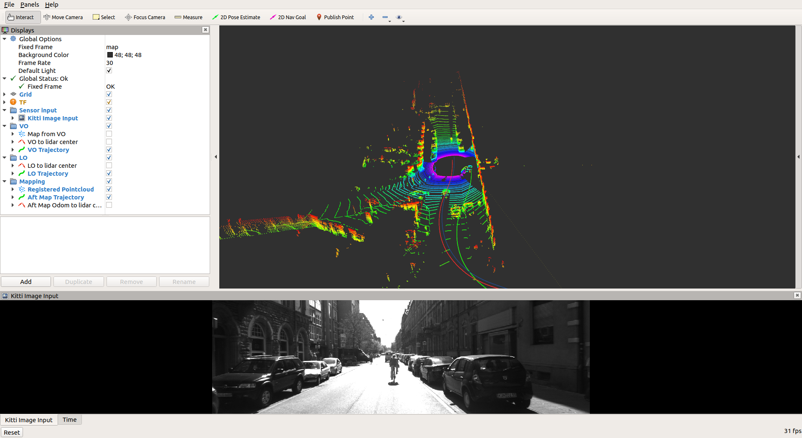

# Prerequisites

OpenCV 4.5.1
PCL 1.2

# Usage 1

- Step 1, download bag files under "/bags"

- Step 2, `catkin_make`, and then `roslaunch vloam_main vloam_main.launch` (Toggle param ```save_traj``` to save odometry path into txt)

- Step 3, check the sequence number and date for the bag file, and in another terminal, run
```
rostopic pub /load_small_dataset_action_server/goal vloam_main/vloam_mainActionGoal "header:
  seq: 0
  stamp:
    secs: 0
    nsecs: 0
  frame_id: ''
goal_id:
  stamp:
    secs: 0
    nsecs: 0
  id: ''
goal:
  date: '2011_09_26'
  seq: '1' 
  start_frame: 10
  end_frame: 20"
```

- Step 4: repeat step 3 with different seq number

Then, you should see a similar UI like this:


# TODO
- ~Finish VO implementation~
- ~Finish LO implementation~
- ~Combine LO & VO implementation & fix Rviz~
- ~Transform LO & VO to velodyne center & save trajectory to txt~
- Fuse VO offline and feed to LO init
- Evaluate odometry 
- Fix tf tree(minor)

# Naming convention for transformations

## C++ type to name

- `tf2::transform` => T
- `geometry_msgs::transform` => tf
- `geometry_msgs::Stampedtransform` => stamped_tf
- `Eigen::Isometry3f` => eigen_T

## Math of transformations

(Take T as the example)

`frameA_T_frameB` means $T_{frameB}^{frameA}$

Besides, $T = \begin{bmatrix}R & t \\ 0 & 1 \end{bmatrix}$

## Multiple odometry sources

Except from static transformations, VLOAM has three odometry sources: VO, LO, MO. To distinguish them, these sources will also be in the names. Here are some examples:

- `tf2::transform` in VO => VOT
- `geometry_msgs::transform` in MO => MOtf
- `geometry_msgs::Stampedtransform` in LO => stamped_LOtf
- `Eigen::Isometry3f` in VO => eigen_VOT

# `vloam_main.cpp` code explanation

## `main`

- Read parameters from roslaunch
- Generate publishers and subscribers after nh is created
- Setup the action server, with `execute` as the callback

## `execute`

- Keep finishing initialization tasks, i.e. clean cache and call `init()`
  - Instantiate the message filter reading image, point cloud and camera info at the same time
  - message filter will start its `callback`
- Read goal from the goal topic and load rosbag

## `callback`

- Section 1: Process Image // takes ~34ms
- Section 2: Process Static Transformations and Camera Intrinsics
- Section 3: Process Point Cloud // takes ~2.6ms
  - `point_cloud_pcl` is a pcl point cloud obj, which might be further reused
- Section 4: Solve VO // takes ~11ms
- Section 5: Publish VO
  - `dynamic_broadcaster.sendTransform(world_stamped_tf_base);` is the final result from VO. Base_link of the vehicle on the ground serves at the bridge between other frames on vehicle and world coordinate `map`. `world` frame is occupied by rosbag, so `map` is the world here.
  - Before that, `velo_last_T_velo_curr` updates the VO result in velodyne frame.